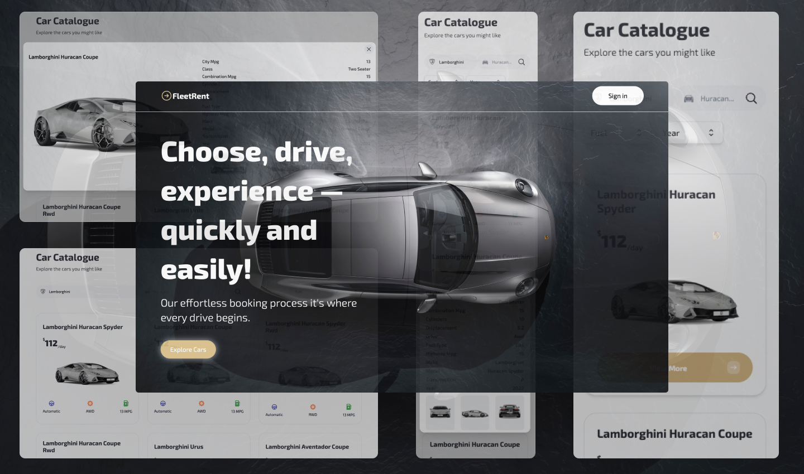

Live demo ➡️ https://fleet-rent-concept.vercel.app

I created a car rental company concept page to practice and learn Next.js and understand how it differs from React. My main goal was to get comfortable with it's key features and new file structure, which helped me to become ready for future projects in Next.js.

The page has a responsive design made with Tailwind CSS and connects to two databases. One database holds info about specific car models like price, model, engine type, and drive type, offering a wide range of vehicles for users to browse. The other database provides 3D car models from different angles, which are displayed alongside specific car details.

On the website, customers can effortlessly search and explore various cars, access detailed information, and if it wouldn't be a concept page e.g. make informed decisions regarding their rental or booking preferences.

This is a [Next.js](https://nextjs.org/) project bootstrapped with [`create-next-app`](https://github.com/vercel/next.js/tree/canary/packages/create-next-app).

## Getting Started

First, run the development server:

```bash
npm run dev
# or
yarn dev
# or
pnpm dev
```

Open [http://localhost:3000](http://localhost:3000) with your browser to see the result.
